# FINA4359 Quantitative Minute Bar Analysis

FINA4359 Group 1 Quantitative Minute Bar Analysis. This repository only contains most of Lio's part of the project.

## Introduction

In this part, the focus will be on the effect of the stock price gap due to overnight trading on the price of the same stock on the next day.

Specifically, the `Gap` of a stock is obtained by:

$$
\text{Gap} = \frac{\text{Open} - \text{PreClose}}{\text{PreClose}}
$$

where `Open` is today's opening price, `PreClose` is yesterday's closing price.

By analyzing the correlation between `Gap` and today's price trend, it is easily found that there are reversal in the price after the market opens. This is called the "Gap Reversal" effect.

We analyzed the effect of this phenomenon using different metrics and methods. For example, since `Gap` can be affected by many factors, such as the general market trend, the stock's own trend, etc., we analyzed the reversal effect by considering these factors separately. At the end, we used the most effective factors to build the trading strategy.

Additionally, we analyzed time length of the effect since the market opens, which is found to be from 9:30 to around 10:30. We utilized this information as a signal to decide when to close the position.

## Data

To facilitate the analysis, the data from `2021-01-01` to `2024-06-01` of a variety of selected stocks from several sectors is used:

- Photovoltaic sector: `601012.SH`, `688223.SH`, `002459.SZ`, `600438.SH`, `688472.SH`
- Semiconductor sector: `688981.SH`, `600584.SH`, `688008.SH`, `688126.SH`, `688041.SH`
- Communication service sector: `000839.SZ`, `600050.SH`, `601728.SH`, `300310.SZ`, `002123.SZ`
- Communication device sector: `600105.SH`, `002583.SZ`, `000063.SZ`, `600734.SH`, `600522.SH`

These stocks are selected for their high daily trading volume.

## Insignificant Early Findings

In early stages, multi-layer perceptron (MLP) model was used to predict the price trend on the next day. The model was given yesterday's price change ratio's standard deviation `ChangeRatioStd`, yesterday's price change ratio's mean `ChangeRatioMean`, yesterday's end of date change ratio `ChangeRatioEod`, and the overnight price gap `Gap`.

The cross validation score for today's price change ratio mean in the morning `ChangeRatioMeanMorning` was `-0.04044558  0.01996921 -0.05081262 -0.04666821 -0.03570203`, which is insignificant (see figure below for one of the prediction results).

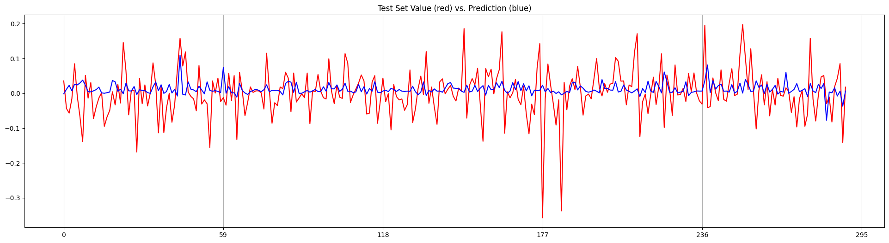

On the other hand, the cross validation score for today's price change ratio standard deviation in the morning `ChangeRatioStdMorning` was `0.4673735  0.34171203 0.43009767 0.35201491 0.3125529`, which is much better (see figure below for one of the prediction results). However, the standard deviation cannot contribute much to the trading strategy.

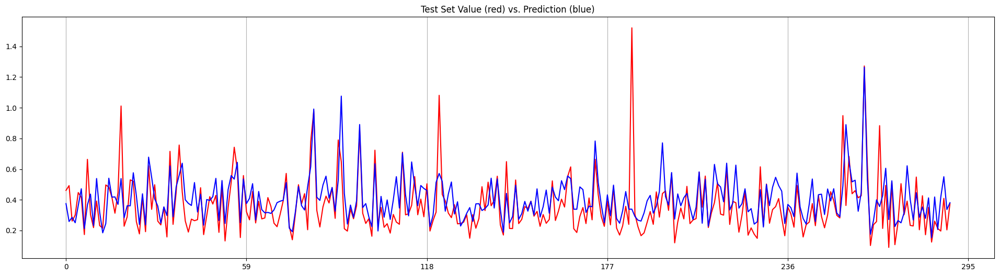

## Statistical Analysis

Then, statistical analysis is used to analyze the correlation between `Gap` and today's price trend.

Linear regression analysis was used to analyze the correlation between `Gap` and the accumulated change ratio `AccChangeRatio`. In the 10:00 result, the R-squared value is only 0.001, which is very low. This shows a very weak correlation between `Gap` and `AccChangeRatio` (see below for the regression result). Also note that the high coefficient is caused by the difference in the scale of the two variables, i.e. `Gap` is measured in real number while `AccChangeRatio` is measured in percentage.

```
                            OLS Regression Results                            
==============================================================================
Dep. Variable:         AccChangeRatio   R-squared:                       0.001
Model:                            OLS   Adj. R-squared:                  0.001
Method:                 Least Squares   F-statistic:                     8.540
Date:                Thu, 12 Dec 2024   Prob (F-statistic):            0.00348
Time:                        11:23:47   Log-Likelihood:                -21702.
No. Observations:               11095   AIC:                         4.341e+04
Df Residuals:                   11093   BIC:                         4.342e+04
Df Model:                           1                                         
Covariance Type:            nonrobust                                         
==============================================================================
                 coef    std err          t      P>|t|      [0.025      0.975]
------------------------------------------------------------------------------
const          0.0785      0.016      4.833      0.000       0.047       0.110
Gap           -2.9536      1.011     -2.922      0.003      -4.935      -0.972
==============================================================================
Omnibus:                     3667.835   Durbin-Watson:                   1.988
Prob(Omnibus):                  0.000   Jarque-Bera (JB):           108056.350
Skew:                           0.977   Prob(JB):                         0.00
Kurtosis:                      18.163   Cond. No.                         62.2
==============================================================================
```

By plotting the data points and the regression lines of the time period from 9:30 to 11:30 with 15 minutes interval, it can be seen that the data points are scattered and the regression lines are almost horizontal, which indicates a very weak correlation (see below for the plot). Furthermore, the T-value of the coefficients are not always significant, they fluctuate a lot over the time period.

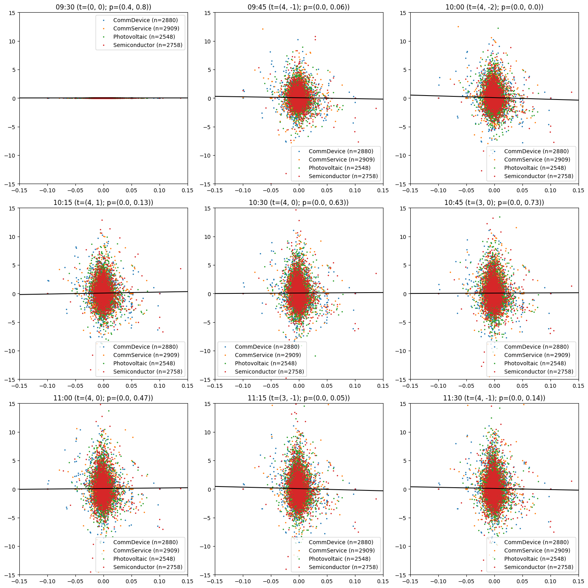

However, if a more straightforward approach is used and the number of positive and negative `Gap` and `AccChangeRatio` is counted, the result is more significant. It is found that the number of instances where `Gap`'s sign is opposite to `AccChangeRatio`'s sign is consistently at around 1.5 times the number of instances where `Gap`'s sign is the same as `AccChangeRatio`'s sign (see below for the table).

|    | Time     |   NoGapSignEqAccChangeRatio |   NoGapSignNeAccChangeRatio |
|----|----------|-----------------------------|-----------------------------|
|  0 | 09:30:00 |                      181022 |                      271108 |
|  1 | 10:00:00 |                      179372 |                      272758 |
|  2 | 10:30:00 |                      180435 |                      271695 |
|  3 | 11:00:00 |                      180591 |                      271539 |
|  4 | 11:30:00 |                        6009 |                        9062 |
|  5 | 12:00:00 |                           0 |                           0 |
|  6 | 12:30:00 |                           0 |                           0 |
|  7 | 13:00:00 |                      176634 |                      260425 |
|  8 | 13:30:00 |                      183036 |                      269094 |
|  9 | 14:00:00 |                      183948 |                      268182 |
| 10 | 14:30:00 |                      184869 |                      267261 |
| 11 | 15:00:00 |                        6188 |                        8883 |

Given that in the plot it is not shown that the `AccChangeRatio` is particularly high or low, and that it is found that there are significantly more days where `Gap`'s sign is opposite to `AccChangeRatio`'s sign, it is possible that the "Gap Reversal" effect exists in this dataset.

## Trading Strategy

With the above findings, a trading strategy is built. The initial strategy is to long from 9:30 to the specific time when `Gap` is negative and short from 9:30 to the specific time when `Gap` is positive. The result has shown significant excess return over simply longing the stock until the specific time (see below for the plot).

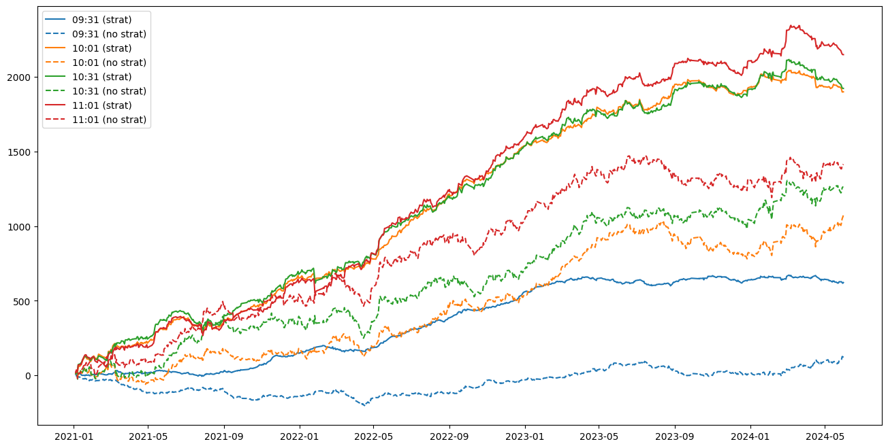

The excess return can be shown by subtracting the strategy return by the return of simply longing the stock until the specific time (see below for the plot).

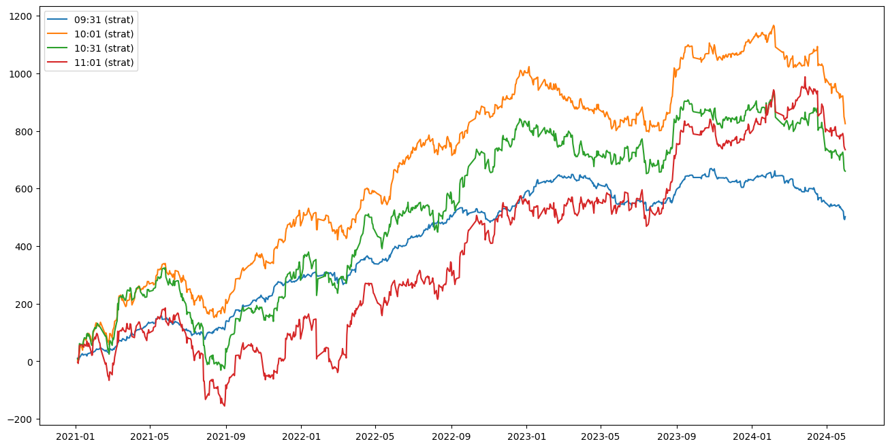

By breaking down the trading strategy into different sectors, it is found that the trading strategy is more effective in the photovoltaic sector and the semiconductor sector (see below for the plot).

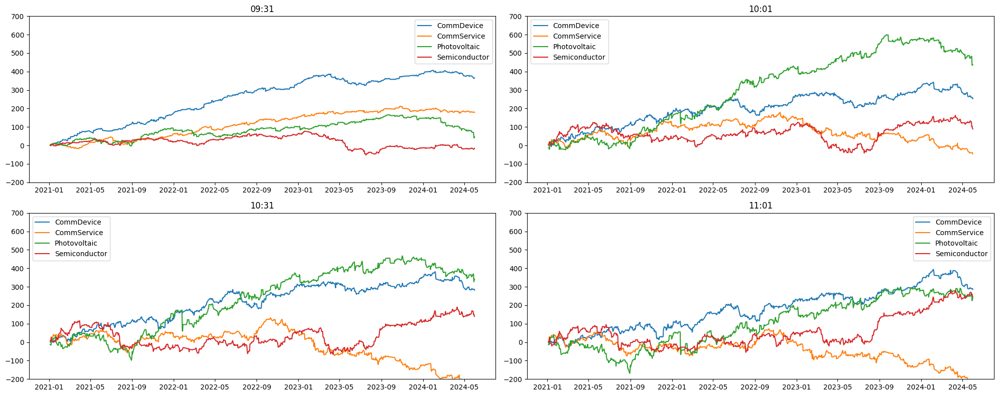

Taking the photovoltaic sector as an example as it is the most effective sector given the strategy, the inidividual stock's return is plotted for further analysis (see below for the plot).

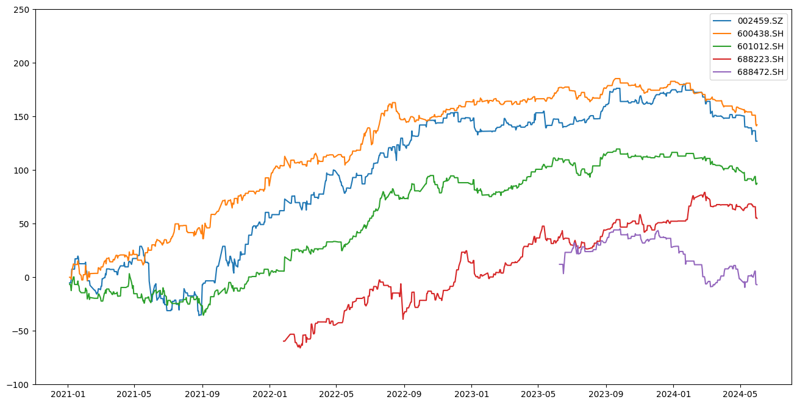

We tried a different approach by using a rolling rank of the `Gap`. When the rolling window is 30 days, and the condition is to long when the rank is in the bottom 20 and long when the rank is in the top 10, except `688472.SH`, other stocks' results are similar to the initial strategy (see below for the plot). Other rolling window sizes and rank conditions are also tested, the result is similar. At the end, we didn't use this approach in the final trading strategy because it is not as effective as the initial strategy.

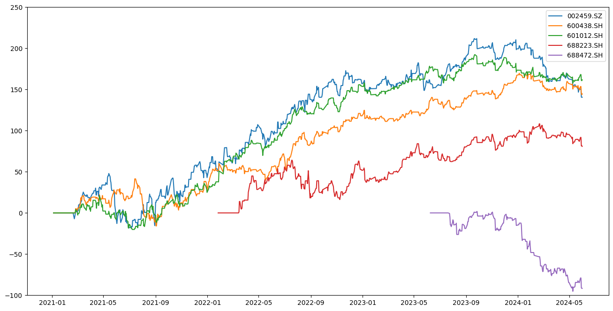

Furthermore, we analyzed the strategy's performance due to the overall market trend. We used the `000001.SH` SSE Composite Index to represent the overall market trend. By calculating the equivalent `Gap` of the index `IndexGap`, we tried different combinations of `Gap` and `IndexGap` for the trading strategy. The strategy to long when `Gap` is negative and `IndexGap` is positive or neutral, and short when `Gap` is positive and `IndexGap` is negative or neutral shows much less excess return than the initial strategy (see below for the plot).

| `Gap` \ `IndexGap` | +ve | 0 | -ve |
|--------------------|-----|---|-----|
| +ve                | -1  | 0 | 0   |
| -ve                | 0   | 0 | +1  |

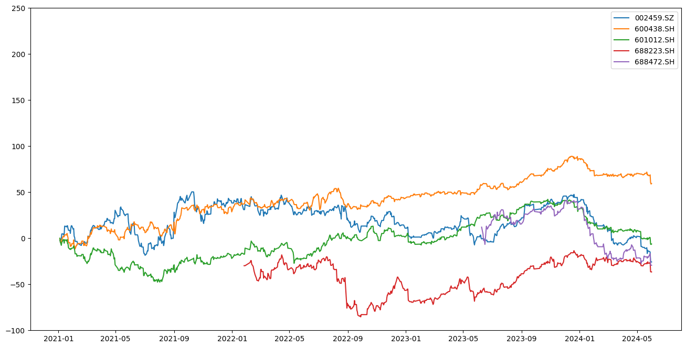

On the other hand, the strategy to long when `Gap` is negative and `IndexGap` is negative, and short when `Gap` is positive and `IndexGap` is positive shows similar excess return than the initial strategy (see below for the plot). This indicates that the overall market trend has a significant impact on the trading strategy compared to the individual stock's trend.

| `Gap` \ `IndexGap` | +ve | 0  | -ve |
|--------------------|-----|----|-----|
| +ve                | 0   | -1 | -1  |
| -ve                | +1  | +1 | 0   |

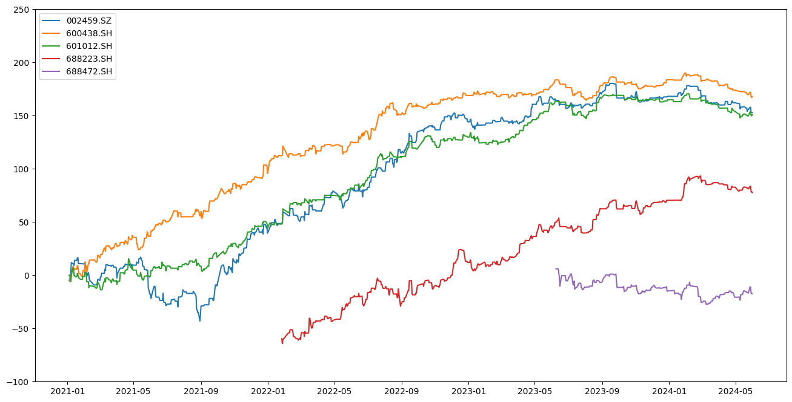

Because the initial strategy always spend 1 dollar amount per day for the investment while the new strategy spends less than 1 dollar amount per day, to make the comparison fair, we also adjusted the amount to be spent per day for this newer strategy. The result shows that the newer strategy becomes more effective than the initial strategy given the same amount spent per day (see below for the plot).

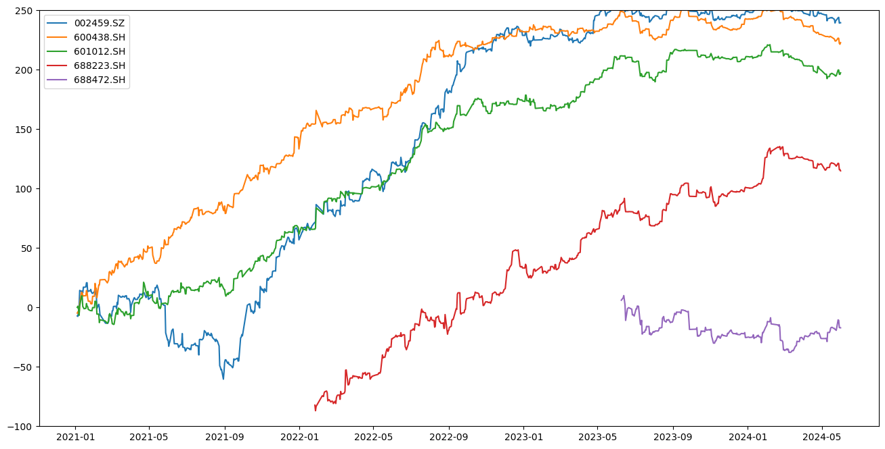

When viewing other sectors, the final strategy is much more effective in the photovoltaic sector and the excess return is consistently higher (see below for the plot where blue lines represent photovoltaic stocks while red lines represent the other stocks listed in the [Data](#data) section).

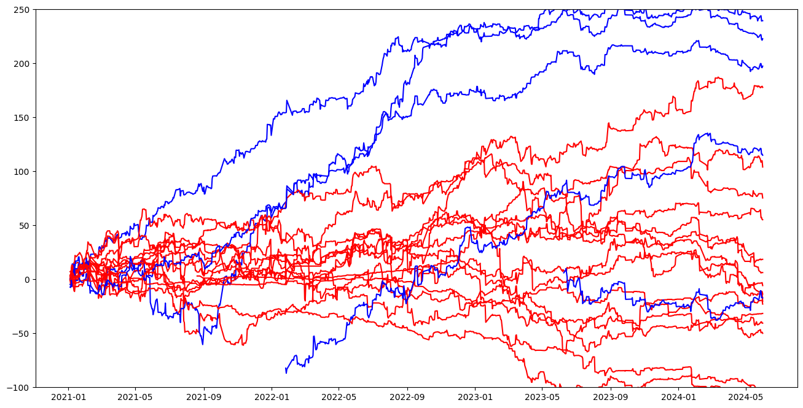

For comparison, if we only trade based on `IndexGap` the effectiveness is not better than the initial strategy (see below for the plot).

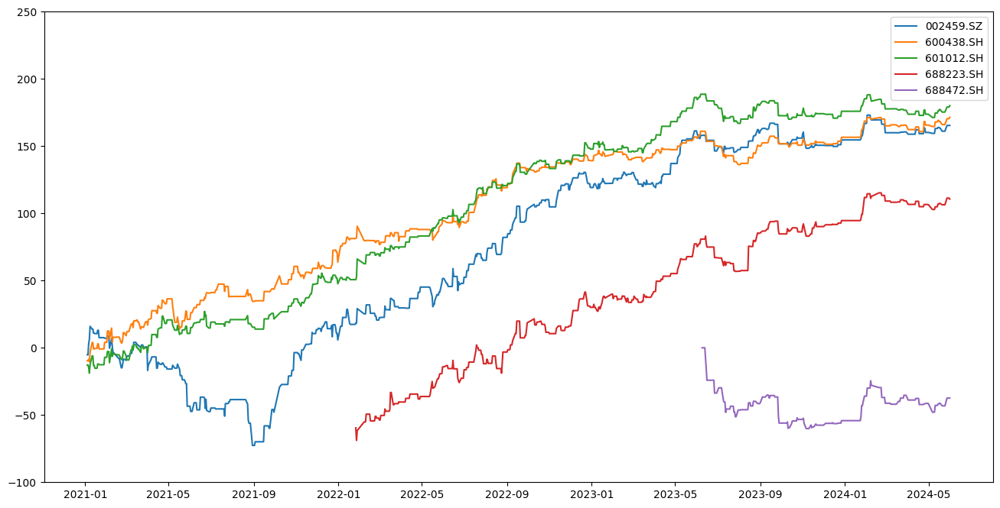

## Conclusion

In conclusion, the "Gap Reversal" effect exists in the dataset. The trading strategy built based on this effect is effective, especially in the photovoltaic sector. The overall market trend has a significant impact on the trading strategy compared to the individual stock's trend. The trading strategy is more effective when the overall market trend is considered. The trading strategy is more effective in the photovoltaic sector compared to other sectors.

However, limitations also applies as only 2021 to 2024 data is used. After some qualitative study, it is suggested that the high excess return of photovoltaic stocks may be due to China's recent policy on renewable energy, especially [wind and solar powers](https://www.spglobal.com/esg/s1/research-analysis/chinas-updated-2030-climate-targets-beyond-carbon-peak.html). This may not be sustainable in the future as we see the excess return slow down after 2023.